<div align="center">

# 📝 Modern To-Do List Application

[](https://nodejs.org/)
[](https://expressjs.com/)
[](https://developer.mozilla.org/en-US/docs/Web/JavaScript)
[](https://developer.mozilla.org/en-US/docs/Web/HTML)
[](https://developer.mozilla.org/en-US/docs/Web/CSS)
[](https://ejs.co/)

[](https://opensource.org/licenses/MIT)
[](http://makeapullrequest.com)
[](https://github.com/sunbyte16/modern-todo-app/graphs/commit-activity)

**A feature-rich, interactive To-Do List application built with Node.js, Express.js, and modern web technologies.**

[🚀 Live Demo](https://lively-dodol-cc397c.netlify.app) • [📖 Documentation](#-installation--setup) • [🐛 Report Bug](https://github.com/sunbyte16/modern-todo-app/issues) • [✨ Request Feature](https://github.com/sunbyte16/modern-todo-app/issues)

</div>

## ✨ Features

<div align="center">

|      🎯 Core Features       | 🚀 Advanced Features |   💫 User Experience    |
| :-------------------------: | :------------------: | :---------------------: |
|  ✅ Add/Edit/Delete Tasks   |  🎯 Priority Levels  |  📱 Responsive Design   |
| ✅ Mark Complete/Incomplete | 🏷️ Custom Categories |     🎨 Modern UI/UX     |
|    ✅ Real-time Counters    | 📅 Due Date Tracking |  ⌨️ Keyboard Shortcuts  |
|    ✅ Persistent Storage    |  🔍 Smart Filtering  | 🎯 Interactive Elements |
|     ✅ Bulk Operations      |  ✏️ Inline Editing   |  💫 Smooth Animations   |

</div>

### 🎨 **Modern Interface**

- 🌈 Beautiful gradient backgrounds and color schemes
- 🎭 Smooth hover effects and transitions
- � Clean, minimalist design with intuitive navigation
- � Interact ive task items with visual feedback

### 🔧 **Smart Functionality**

- 🎯 **Priority System**: Color-coded High, Medium, Low priorities
- 🏷️ **Category Management**: Organize tasks by custom categories
- 📅 **Date Management**: Set and track due dates with visual indicators
- 🔍 **Advanced Filtering**: Filter by status and category simultaneously
- 🗑️ **Bulk Actions**: Clear all completed tasks with one click

### ⚡ **Performance & Database**

- 🚀 Fast, lightweight application with cloud database
- 🍃 **MongoDB Atlas**: Enterprise-grade cloud database
- 📊 **Real-time Analytics**: Task completion insights and statistics
- 🔄 **Auto-Sync**: Tasks synchronized across all devices
- 💾 **Persistent Storage**: Data survives server restarts
- 🔒 **Secure**: Environment-based database configuration

### 🎯 **Accessibility & UX**

- 📱 Mobile-first responsive design
- ⌨️ Full keyboard navigation support
- 🎯 Click-to-toggle functionality for better UX
- 🌐 Cross-platform compatibility

## 🛠️ Installation & Setup

<div align="center">

### 🚀 Quick Start

</div>

```bash
# 📥 Clone the repository
git clone https://github.com/sunbyte16/modern-todo-app.git

# 📂 Navigate to project directory
cd modern-todo-app

# 📦 Install dependencies
npm install

# 🚀 Start the application (MongoDB Atlas auto-connects)
npm start

# 🌐 Open your browser and visit
# http://localhost:3000
```

> **🍃 MongoDB Atlas Ready**: The application is pre-configured with MongoDB Atlas cloud database. No additional database setup required!

### 📋 Prerequisites


- **Node.js** (v14.0.0 or higher)
- **npm** (v6.0.0 or higher)
- **MongoDB Atlas** (Cloud database - configured and ready to use)

### 🔧 Development Setup

```bash
# 🔄 For development with auto-restart (recommended)
npm run dev

# 🌱 Seed initial data (optional)
npm run seed

# 🧪 Run tests (if available)
npm test

# 📊 Check for updates
npm outdated
```

### 🍃 **MongoDB Atlas Integration**

<div align="center">

[](https://www.mongodb.com/atlas)

**✅ Pre-configured with MongoDB Atlas Cloud Database**

</div>

#### **🚀 Ready to Use Features:**

- **☁️ Cloud Database**: MongoDB Atlas cluster pre-configured
- **🔄 Auto-Fallback**: Switches to in-memory storage if database unavailable
- **📊 Real-time Stats**: Advanced analytics and task insights
- **🔒 Secure**: Environment-based configuration
- **🌍 Global**: Access your tasks from anywhere

#### **🔧 Database Configuration:**

The application is pre-configured with MongoDB Atlas:

```env
# Already configured in .env file
MONGODB_URI=mongodb+srv://cluster0.wttyk0w.mongodb.net/modern-todo
```

#### **📈 Database Features:**

| Feature                 | Description                         | Status    |
| ----------------------- | ----------------------------------- | --------- |
| **Persistent Storage**  | Tasks survive server restarts       | ✅ Active |
| **Cloud Sync**          | Access tasks from any deployment    | ✅ Active |
| **Advanced Queries**    | Fast filtering and searching        | ✅ Active |
| **Real-time Analytics** | Task completion statistics          | ✅ Active |
| **Automatic Backups**   | MongoDB Atlas built-in backups      | ✅ Active |
| **Fallback Mode**       | In-memory storage if DB unavailable | ✅ Active |

#### **🛠️ Additional Setup (Optional):**

- **Local Development**: See [MONGODB_SETUP.md](MONGODB_SETUP.md) for local MongoDB setup
- **Custom Database**: Update `.env` file with your own MongoDB URI
- **Production Deploy**: Environment variables automatically handled

## 📦 Tech Stack & Dependencies

<div align="center">

### 🏗️ Built With

[](https://expressjs.com/)
[](https://ejs.co/)
[](https://developer.mozilla.org/en-US/docs/Web/CSS)
[](https://developer.mozilla.org/en-US/docs/Web/JavaScript)

</div>

| Package         | Version   | Purpose                        | Badge                                                                           |
| --------------- | --------- | ------------------------------ | ------------------------------------------------------------------------------- |
| **express**     | `^4.18.0` | Web framework for Node.js      |  |
| **body-parser** | `^1.20.0` | Parse incoming request bodies  |       |
| **ejs**         | `^3.1.0`  | Embedded JavaScript templating |              |
| **mongoose**    | `^8.0.0`  | MongoDB object modeling        |             |
| **dotenv**      | `^16.0.0` | Environment variable loader    |                 |

## 🎯 Usage Guide

<div align="center">

### 📝 How to Use

</div>

#### ➕ Adding Tasks

```
1. 📝 Enter your task in the main input field
2. 🎯 Select priority level (🔴 High / 🟡 Medium / 🟢 Low)
3. 🏷️ Add a category (optional)
4. 📅 Set a due date (optional)
5. ✅ Click "Add Task" or press Ctrl+Enter
```

#### 🔧 Managing Tasks

| Action                | Method                                | Icon    |
| --------------------- | ------------------------------------- | ------- |
| **Toggle Completion** | Click circle icon or anywhere on task | ✅ / ⭕ |
| **Edit Task**         | Click the edit icon                   | ✏️      |
| **Delete Task**       | Click the trash icon                  | 🗑️      |
| **Filter Tasks**      | Use filter buttons and dropdown       | 🔍      |

#### ⌨️ Keyboard Shortcuts

| Shortcut       | Action      | Description                  |
| -------------- | ----------- | ---------------------------- |
| `Ctrl + Enter` | 🚀 Submit   | Submit forms quickly         |
| `Escape`       | ❌ Close    | Close modal dialogs          |
| `Tab`          | 🔄 Navigate | Navigate between form fields |
| `Space`        | ✅ Toggle   | Toggle task completion       |

## 🎨 Customization

### Styling

The application uses modern CSS with:

- CSS Grid and Flexbox for layouts
- CSS Variables for consistent theming
- Smooth transitions and animations
- Responsive breakpoints for mobile devices

### Adding New Features

The modular structure makes it easy to extend:

- Add new task properties in `server.js`
- Update the UI in `views/index.ejs`
- Enhance styling in `public/styles.css`
- Add interactions in `public/script.js`

## 🏗️ Technical Architecture

<div align="center">

### 🔧 System Architecture

```mermaid
graph TD
    A[🌐 Client Browser] --> B[📡 Express.js Server]
    B --> C[📝 EJS Templates]
    B --> D[💾 In-Memory Storage]
    C --> E[🎨 CSS Styling]
    C --> F[⚡ JavaScript]
    E --> A
    F --> A
```



</div>

### 🏛️ Architecture Overview

| Layer        | Technology                                                                                                                                                                                                    | Purpose                        |
| ------------ | ------------------------------------------------------------------------------------------------------------------------------------------------------------------------------------------------------------- | ------------------------------ |
| **Backend**  |   | Server runtime & web framework |
| **Frontend** |      | Templating & client-side logic |
| **Styling**  |                                                                                                                  | Modern UI with animations      |
| **Storage**  |  💾 In-Memory Fallback                                                                                  | Persistent MongoDB + fallback  |

### 📁 Project Structure

```
📦 modern-todo-app/
├── 🚀 server.js              # Main server application
├── 📋 package.json           # Dependencies & scripts
├── 📖 README.md              # Project documentation
├── 📂 views/
│   └── 🎨 index.ejs          # Main EJS template
└── 📂 public/
    ├── 🎨 styles.css         # Modern CSS styling
    └── ⚡ script.js          # Client-side JavaScript
```

### 🛣️ API Endpoints

| Method | Endpoint                | Description                   | Status |
| ------ | ----------------------- | ----------------------------- | ------ |
| `GET`  | `/`                     | 🏠 Main application page      | ✅     |
| `POST` | `/add`                  | ➕ Add new task               | ✅     |
| `POST` | `/toggle/:id`           | 🔄 Toggle task completion     | ✅     |
| `POST` | `/edit/:id`             | ✏️ Edit existing task         | ✅     |
| `POST` | `/delete/:id`           | 🗑️ Delete task                | ✅     |
| `POST` | `/clear-completed`      | 🧹 Remove all completed tasks | ✅     |
| `GET`  | `/api/tasks`            | 📊 Get all tasks (JSON API)   | ✅     |
| `POST` | `/api/tasks/:id/toggle` | 🔄 Toggle task via API        | ✅     |
| `GET`  | `/api/stats`            | 📈 Get task statistics        | ✅     |
| `POST` | `/api/seed`             | 🌱 Seed initial data          | ✅     |

## 🚀 Deployment

<div align="center">

### 🌐 Multiple Deployment Options Available

[](https://pages.github.com)
[](https://railway.app)
[](https://render.com)
[](https://heroku.com)

</div>

### 📋 **Two Deployment Versions:**

| Version             | Technology         | Database             | Best For                       |
| ------------------- | ------------------ | -------------------- | ------------------------------ |
| **🌐 GitHub Pages** | Static HTML/CSS/JS | Browser LocalStorage | Quick demo, portfolio showcase |
| **🚀 Full Server**  | Node.js + Express  | MongoDB Atlas        | Production, full features      |

### 🌐 **Option 1: GitHub Pages (Static Version)**

**✅ Already Deployed!** Visit: `https://sunbyte16.github.io/To-Do-List-Application`

**Features:**

- ✅ **Instant Deploy**: Works immediately on GitHub Pages
- ✅ **Browser Storage**: Uses localStorage for data persistence
- ✅ **Full UI**: Complete modern interface with all styling
- ✅ **No Server Required**: Pure client-side application
- ✅ **Fast Loading**: Optimized static files

**How it works:**

- Uses `index.html` at repository root
- Data stored in browser's localStorage
- All features work except server-side MongoDB integration

### ☁️ **Option 2: Full Server Version (MongoDB Atlas)**

**For Production Apps:** Deploy the Node.js server version for full features

**MongoDB Atlas Advantages:**

- **✅ No Database Setup**: MongoDB Atlas handles all database infrastructure
- **✅ Global Access**: Database accessible from any deployment platform
- **✅ Auto-Scaling**: MongoDB Atlas scales automatically with your app
- **✅ Built-in Security**: Enterprise-grade security and backups

### 🚀 **Server Deployment Options**

#### **Railway (Recommended for Node.js)**

```bash
# Install Railway CLI
npm install -g @railway/cli

# Login and deploy
railway login
railway init
railway up
```

#### **Render**

1. Connect your GitHub repository to Render
2. Choose "Web Service"
3. Build Command: `npm install`
4. Start Command: `npm start`
5. Environment Variables: Automatically detected from `.env`

#### **Heroku**

```bash
# Install Heroku CLI and login
heroku create your-app-name
git push heroku main
```

### 🔧 **Environment Variables for Production**

The application automatically uses the MongoDB Atlas connection from your `.env` file. For production:

```env
NODE_ENV=production
PORT=3000
MONGODB_URI=mongodb+srv://cluster0.wttyk0w.mongodb.net/modern-todo
```

### 📊 **Production Features**

- **🔄 Auto-Fallback**: If MongoDB Atlas is temporarily unavailable, switches to in-memory storage
- **📈 Performance**: Optimized queries with MongoDB indexes
- **🔒 Security**: Environment-based configuration keeps credentials secure
- **📊 Monitoring**: Built-in connection status and error handling

## 🚀 Future Roadmap

<div align="center">

### 🎯 Planned Enhancements

</div>

| Feature                      | Priority  | Status         | Description                              |
| ---------------------------- | --------- | -------------- | ---------------------------------------- |
| � **\*Database Integration** | 🔴 High   | 📋 Planned     | MongoDB, PostgreSQL, or SQLite support   |
| 👥 **User Authentication**   | 🔴 High   | 📋 Planned     | Multi-user support with login/register   |
| 🔄 **Real-time Updates**     | 🟡 Medium | 💭 Considering | WebSocket integration for live updates   |
| 📊 **Analytics Dashboard**   | 🟡 Medium | 💭 Considering | Task completion statistics & insights    |
| 🔔 **Smart Notifications**   | 🟡 Medium | 💭 Considering | Due date reminders & alerts              |
| 📱 **PWA Support**           | 🟢 Low    | 💭 Considering | Offline functionality & app installation |
| 🎨 **Theme System**          | 🟢 Low    | 💭 Considering | Dark mode & custom themes                |
| 📤 **Data Management**       | 🟢 Low    | 💭 Considering | Export/Import tasks (JSON, CSV)          |

### 🎨 UI/UX Improvements

- 🌙 **Dark Mode Toggle**
- 🎭 **Custom Theme Builder**
- 📱 **Enhanced Mobile Experience**
- 🎪 **Advanced Animations**
- 🎯 **Drag & Drop Functionality**

## 🤝 Contributing

<div align="center">

### 💝 We Welcome Contributions!

[](https://github.com/sunbyte16/modern-todo-app/graphs/contributors)
[](https://github.com/sunbyte16/modern-todo-app/network/members)
[](https://github.com/sunbyte16/modern-todo-app/stargazers)
[](https://github.com/sunbyte16/modern-todo-app/issues)

</div>

### 🚀 How to Contribute

1. 🍴 **Fork** the repository
2. 🌿 **Create** your feature branch (`git checkout -b feature/AmazingFeature`)
3. 💾 **Commit** your changes (`git commit -m 'Add some AmazingFeature'`)
4. 📤 **Push** to the branch (`git push origin feature/AmazingFeature`)
5. 🔄 **Open** a Pull Request

### 🐛 Found a Bug?

- 📝 [Create an Issue](https://github.com/sunbyte16/modern-todo-app/issues/new)
- 🏷️ Use appropriate labels
- 📋 Provide detailed description

### 💡 Have an Idea?

- 💭 [Start a Discussion](https://github.com/sunbyte16/modern-todo-app/discussions)
- ✨ [Request a Feature](https://github.com/sunbyte16/modern-todo-app/issues/new)

---

## 📄 License

<div align="center">

[](https://opensource.org/licenses/MIT)

**This project is licensed under the MIT License - see the [LICENSE](LICENSE) file for details.**

</div>

---

## 👨‍💻 About the Developer

<div align="center">

### Created by **Sunil Sharma**

[](https://github.com/sunbyte16)
[](https://www.linkedin.com/in/sunil-kumar-bb88bb31a/)
[](https://lively-dodol-cc397c.netlify.app)

**Full Stack Developer | Node.js Enthusiast | Open Source Contributor**

---

### 🌟 Show Your Support

If this project helped you, please consider giving it a ⭐!

[](https://buymeacoffee.com/sunilsharma)

---

<div align="center">
  
  
  
</div>

### 📊 Project Stats


---

**© 2k25 𝕊𝕦𝕟𝕚𝕝 𝕊𝕙𝕒𝕣𝕞𝕒. All rights reserved.**

_Enjoy organizing your tasks with this modern To-Do application! 🎉_

</div>
